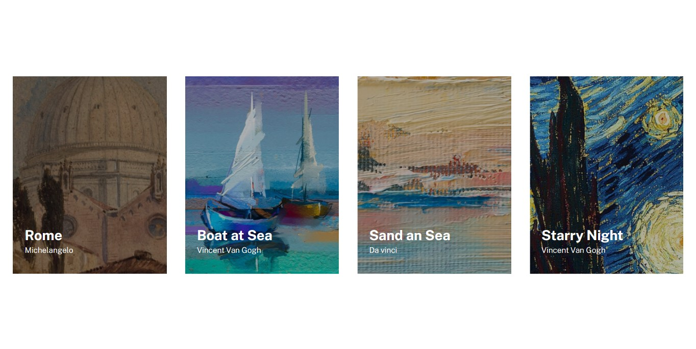

# Exercícios CSS Avançado Flexbox - Lista de imagens

## Sobre o Projeto

O Exercício consiste basicamente em criar uma lista de imagens com pinturas, utilizando flexbox para facilitar a estilização é praticar o que foi aprendido nos módulos passados do curso DevQuest - Dev em Dobro.

## Tecnologias Utilizadas

                 
## Imagens do Projeto

### Desktop

